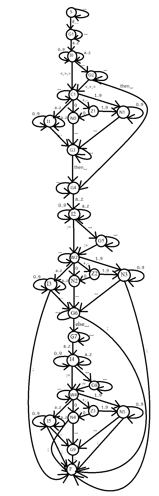

# Синтаксический анализатор конструкции IF
 
Синтаксический анализатор автоматного языка фрагмента условного оператора
языка Turbo Pascal, имеющего вид

IF <условие> THEN <оператор присваивания > [ ELSE <оператор присваивания > ];

<условие>:: = <левая часть>[<условная операция><правая часть>]

<оператор присваивания>:: = <левая часть> : = <правая часть>

<левая часть> :: = <идентификатор>

<правая часть> :: = <идентификатор>|<константа целая>

<условная операция> :: = < | > | =

Здесь <идентификатор> - последовательность букв или цифр. Начинается идентификатор только с буквы, за которой могут следовать буквы или цифры.

<константа целая> - целое число, возможно со знаком, учитывает отсутствие незначащего нуля.

  

Семантика:

Длина идентификатора не превышает 8 символов и не может быть зарезервированным словом - IF, THEN, ELSE

Константа целая находится в диапазоне -32768 : +32767

Построить и вывести на печать по завершении анализа неповторяющиеся списки идентификаторов и констант.

Сообщать при анализе строки о месте ошибки курсором и содержание ошибки.

Анализатор работает до первой ошибки, допускает произвольное число пробелов между конструкциями оператора, не учитывается регистр символов.

  

Примеры правильных цепочек:

IF      AB THEN   C:=B;

IF  E=314  THEN  A1:=ABC  ELSE A1:=0;

IF  E1<CD THEN B12 := - 81;

## Граф состояний

## Структура проекта

analyzer/ - синтаксический анализатор 
tests/ - тесты анализатора 
front/ - графическая оболочка 
main.py - точка входа для графической оболочки
